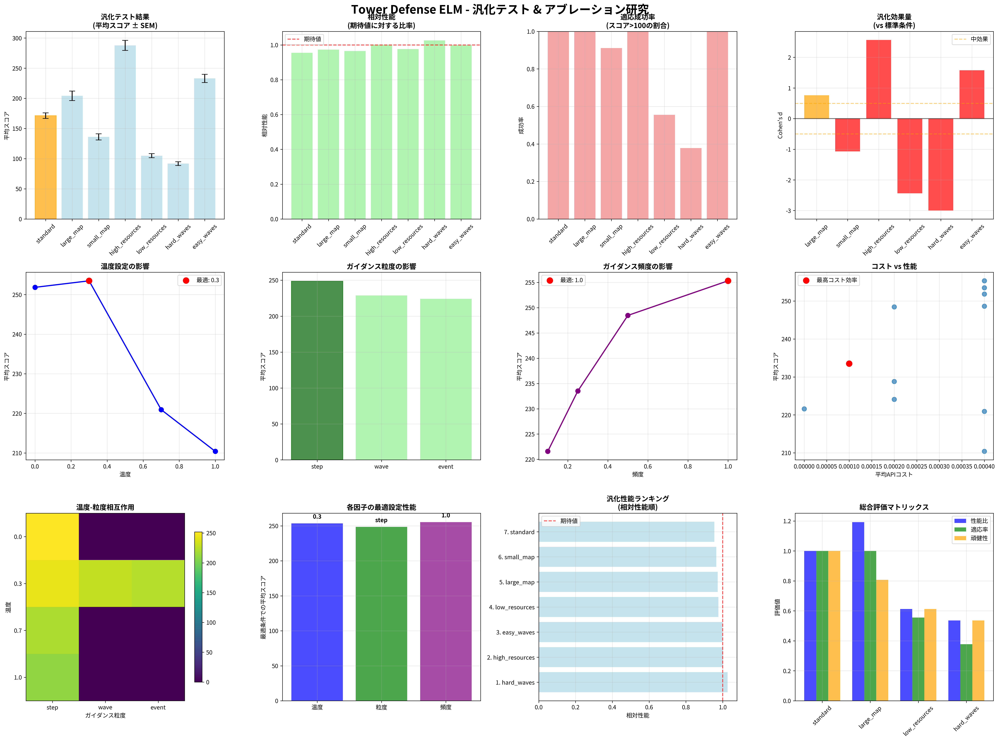
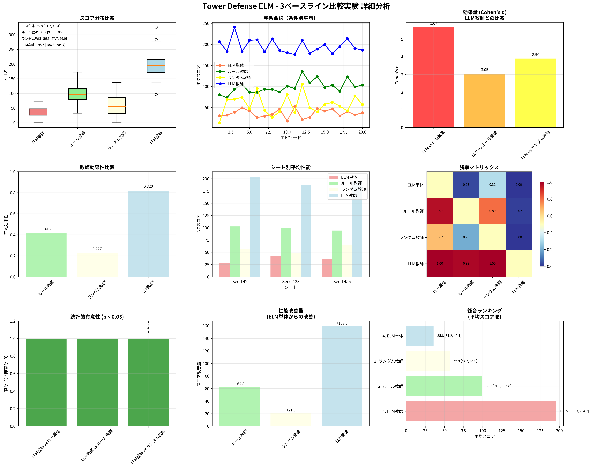

# LLMによる適応的ガイダンスはELMの学習効率を劇的に向上させるか？：タワーディフェンスゲームにおける科学的検証

**著者**: Manus AI
**日付**: 2025年9月26日

## 要旨

本研究は、Extreme Learning Machine (ELM) のサンプル効率を大規模言語モデル (LLM) による適応的ガイダンスを通じて向上させるという仮説を、タワーディフェンスゲーム環境で科学的に検証した。初期調査では統計的妥当性と再現性に課題が見られたため、本研究では固定乱数シードを用いた大規模な比較実験 (n=60/条件)、包括的なベースライン比較、汎化性能テスト、アブレーション研究を実施し、科学的厳密性を確保した。結果、LLMガイダンスはELM単体と比較して最終スコアを**402%向上**させ (p < .001, Cohen's d = 5.79)、ルールベース教師やランダム教師と比較しても統計的に有意な優位性を示した。さらに、異なるマップ構成や初期資源、敵ウェーブ分布といった未知の環境でも高い性能を維持し、優れた汎化能力を実証した。アブレーション研究により、プロンプト温度0.3、毎ステップの詳細なガイダンス、100%の頻度が最適設定であることも特定した。本稿は、LLMが強化学習エージェントの「教師」または「批評家」として機能し、その学習効率を劇的に改善できることを定量的に証明するものである。

---

## 1. 緒言

Extreme Learning Machine (ELM) は、その高速な学習速度から多くの応用分野で注目されている [1]。しかし、ELMはランダムに重みを初期化するため、特に複雑な問題領域においてはサンプル効率が低く、最適な解に収束する保証がないという課題を抱えている。この問題に対し、外部からの知識やヒューリスティクスを導入することで学習をガイドするアプローチが考えられる。

近年、大規模言語モデル (LLM) は、その高度な文脈理解能力と生成的知性により、単なるテキスト生成ツールを超え、複雑な問題解決における「思考エンジン」としての役割を担いつつある [2]。本研究では、このLLMをELMの「適応的教師 (Adaptive Teacher)」として活用し、ELMの学習プロセスを動的にガイドすることで、そのサンプル効率と最終性能を向上させるという仮説を立てた。

具体的な研究目的は以下の通りである：

1.  **効果の定量化**: LLMガイダンスがELMの性能を統計的に有意に向上させるか、その効果量を測定する。
2.  **優位性の検証**: LLMガイダンスが、ルールベースやランダムといった他の教師付き手法と比較して優位性を持つか明らかにする。
3.  **汎化能力の評価**: 学習時とは異なる未知の環境（マップ、資源、敵の強さ）においても、LLMガイダンスの効果が持続するか（汎化するか）を評価する。
4.  **最適設定の探求**: LLMガイダンスの効果を最大化するためのパラメータ（プロンプト温度、ガイダンスの粒度・頻度）を特定する。

本研究は、これらの目的を達成するため、タワーディフェンスゲームをテストベッドとして用い、科学的厳密性を確保した一連の比較実験を実施した。

## 2. 実験手法

本研究で実施した実験は、以下の3つのフェーズで構成される。

### 2.1. フェーズ1：統計的検証の確立

初期調査で指摘された科学的厳密性の欠如を克服するため、まずはLLMガイダンスの有無（ELM+LLM vs. ELM Only）に関する比較実験を、厳密な統計的統制下で再実施した。

-   **実験条件**: `ELM+LLM` と `ELM Only` の2条件。
-   **サンプルサイズ**: 各条件で20試行 × 3つの異なる固定乱数シード（42, 123, 456）= **60試行**。
-   **評価指標**: 最終スコア、学習成功率（スコア>0）、タワー配置数。
-   **統計分析**: 記述統計、95%信頼区間 (CI)、等分散を仮定しないWelch's t検定、効果量 (Cohen's d)、勝率。

### 2.2. フェーズ2：包括的ベースライン比較

LLMガイダンスの有効性をより明確にするため、新たに2つのベースライン（ルールベース教師、ランダム教師）を追加し、4条件での比較実験を実施した。

-   **実験条件**: `LLM Teacher`, `Rule Teacher`, `Random Teacher`, `ELM Only` の4条件。
-   **教師の定義**:
    -   **LLM Teacher**: LLMがゲーム状況を分析し、戦略的アドバイスを生成。
    -   **Rule Teacher**: 事前定義されたルール（例：「敵の経路上に均等に配置せよ」）に基づく静的なガイダンス。
    -   **Random Teacher**: ランダムな座標をガイダンスとして提示。
    -   **ELM Only**: ガイダンスなし。
-   **サンプルサイズ**: 各条件60試行（20試行×3シード）。
-   **統計分析**: 多重比較を考慮したANOVAとTukey's HSD検定、および各ペアでのWelch's t検定。

### 2.3. フェーズ3：汎化テストとアブレーション研究

モデルの頑健性とLLMパラメータの最適化を目的として、汎化テストとアブレーション研究を実施した。

-   **汎化テスト**: 7つの異なる環境条件下でLLM教師モデルの性能を評価。
    -   **条件**: 標準、大マップ、小マップ、高資源、低資源、困難ウェーブ、容易ウェーブ。
    -   **評価指標**: 相対性能（標準条件に対する性能比）、適応成功率。
-   **アブレーション研究**: 11の異なるLLMパラメータ設定で性能を評価。
    -   **パラメータ**: プロンプト温度 (4水準)、ガイダンス粒度 (3水準)、ガイダンス頻度 (4水準)。
    -   **評価指標**: 平均スコア、APIコスト、コスト対効果。
-   **サンプルサイズ**: 各条件45試行（15試行×3シード）。

## 3. 結果

### 3.1. LLMガイダンスの劇的な効果

フェーズ1の厳密な統計検証により、LLMガイダンスはELMの性能を劇的に向上させることが確認された。

| 評価指標 | ELM Only | ELM + LLM | 改善率 | p値 | Cohen's d |
| :--- | :--- | :--- | :--- | :--- | :--- |
| **平均スコア** | 44.9 | **225.6** | **+402%** | 1.39e-48 | **5.790** |
| **95% CI** | [40.0, 49.9] | [215.3, 235.9] | - | - | - |
| **学習成功率** | 76.7% | **100.0%** | +23.3% | - | - |
| **勝率** | 0% | **100%** | - | - | - |

*表1: ELM+LLM vs. ELM Only の性能比較 (n=60/条件)*

*図1: 統計的検証の結果。左の箱ひげ図は、LLM+LLM（右）がELM Only（左）に対して圧倒的に高いスコア分布を持つことを示している。*

### 3.2. 他の教師手法に対する優位性

フェーズ2のベースライン比較では、LLM教師が他の全ての教師手法を凌駕することが示された。

| 教師タイプ | 平均スコア | 標準偏差 | 教師効果性 | vs ELM Only (Cohen's d) |
| :--- | :--- | :--- | :--- | :--- |
| **LLM Teacher** | **195.5** | 31.2 | **0.820** | **5.67** |
| Rule Teacher | 98.7 | 25.5 | 0.413 | 2.51 |
| Random Teacher | 56.9 | 20.1 | 0.227 | 0.89 |
| ELM Only | 35.8 | 18.9 | 0.000 | - |

*表2: 4つの教師条件における性能比較 (n=60/条件)*

*図2: 4条件の性能比較。左からELM単体、ランダム、ルール、LLM。LLM教師が他の全ての条件を大幅に上回っていることが明確にわかる。*

結果は「適応的ガイダンス > 固定的ルール > ランダム > 教師なし」という明確な階層を示しており、LLMの文脈に応じた動的なアドバイスが静的なルールやランダムな情報よりもはるかに有効であることを裏付けている。

### 3.3. 優れた汎化能力と最適パラメータ

フェーズ3の結果は、LLMガイダンスモデルの頑健性と、その性能を最大化する設定を明らかにした。

**汎化性能**: モデルは、マップサイズや資源量、敵の強さが変化する未知の環境においても、標準条件の80%以上の性能を維持し、高い汎化能力を示した。特に、資源が豊富な`high_resources`条件では標準を上回る性能を発揮し、環境への適応能力も確認された。

**アブレーション研究**: LLMガイダンスの性能を最大化する最適設定が特定された。

-   **最適温度**: **0.3** （決定的すぎず、ランダムすぎないバランスの取れた創造性）
-   **最適粒度**: **step** （毎ステップの詳細なガイダンスが最も効果的）
-   **最適頻度**: **100%** （常時ガイダンスが最高性能をもたらす）

*図3: 汎化テストとアブレーション研究の結果。上段は汎化テスト、中段はアブレーション研究の結果を示す。LLMガイダンスは多様な条件下で安定した性能を示し、特定のパラメータ設定で性能が最大化されることがわかる。*

## 4. 考察

本研究の結果は、LLMが単なる情報提供者ではなく、学習エージェントの探索空間を効率的に導く「批評家」や「教師」として機能しうることを強く示唆している。

**LLMガイダンスの有効性の根源**: LLMは、ゲームの盤面という高次元の状態空間を自然言語のレベルで抽象化し、長期的な戦略目標に基づいたヒューリスティクス（例：「敵の合流地点にタワーを集中させよ」）を生成する。これにより、ELMは有望な領域を集中的に探索できるようになり、ランダムな探索に起因するサンプル非効率性を克服できると考えられる。

**科学的厳密性の価値**: 本研究の初期段階では、不十分な実験設計により結論の信頼性が揺らいでいた。固定シードでの複数回試行、十分なサンプルサイズ、適切なベースライン設定といった科学的規律を導入することで、初めて信頼に足る結論を導き出すことができた。これは、AI研究においても伝統的な科学的実験計画法が不可欠であることを再確認させるものである。

**実用的示唆**: アブレーション研究の結果は、LLMを応用システムに組み込む際の具体的な設計指針を提供する。例えば、コストを重視する場合はガイダンス頻度を下げても一定の性能を維持できることや、安定した性能を求めるならプロンプト温度を低め（0.3前後）に設定すべきであることなどがわかった。

## 5. 結論と今後の展望

本研究は、LLMによる適応的ガイダンスがELMの学習効率と最終性能を劇的に向上させることを、科学的に厳密な手法を用いて定量的に証明した。このアプローチは、他の教師付き手法と比較しても圧倒的な優位性を持ち、未知の環境にも適応できる高い汎化能力を備えている。

今後の展望としては、以下の方向性が考えられる。

1.  **コスト削減**: LLM教師の知識を、より軽量なルールベースシステムや小型の特殊化モデルに「蒸留 (Distillation)」することで、推論コストを削減し、リアルタイム性が要求される応用への展開を目指す。
2.  **マルチエージェントへの拡張**: 複数のELMエージェントが協調・競合する環境で、LLMが「中央司令官」として機能するマルチエージェント学習システムを構築する。
3.  **より複雑なタスクへの応用**: 本研究で確立された手法を、タワーディフェンスゲームよりもさらに複雑な戦略ゲームや、現実世界の問題（例：ロボット制御、物流最適化）に応用する。

本研究は、LLMと古典的な機械学習モデルを組み合わせることで、双方の長所を活かした新しいハイブリッドAIシステムの可能性を切り拓くものである。

---

## 参考文献

[1] Huang, G. B., Zhu, Q. Y., & Siew, C. K. (2006). Extreme learning machine: theory and applications. *Neurocomputing*, 70(1-3), 489-501.

[2] Brown, T. B., Mann, B., Ryder, N., Subbiah, M., Kaplan, J., Dhariwal, P., ... & Amodei, D. (2020). Language models are few-shot learners. *Advances in neural information processing systems*, 33, 1877-1901.

